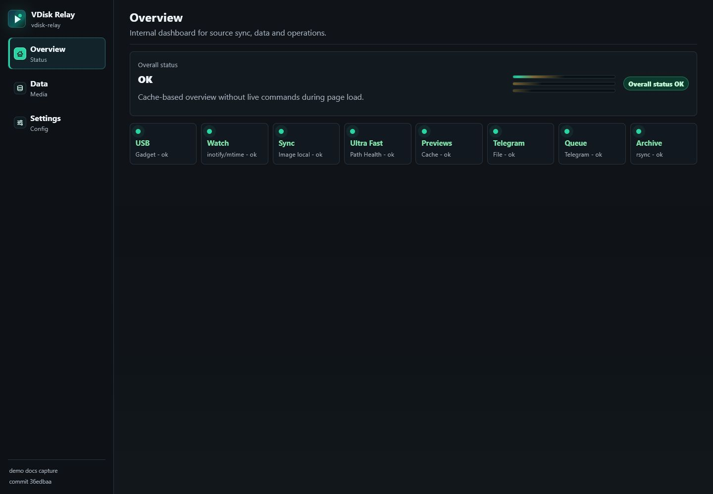
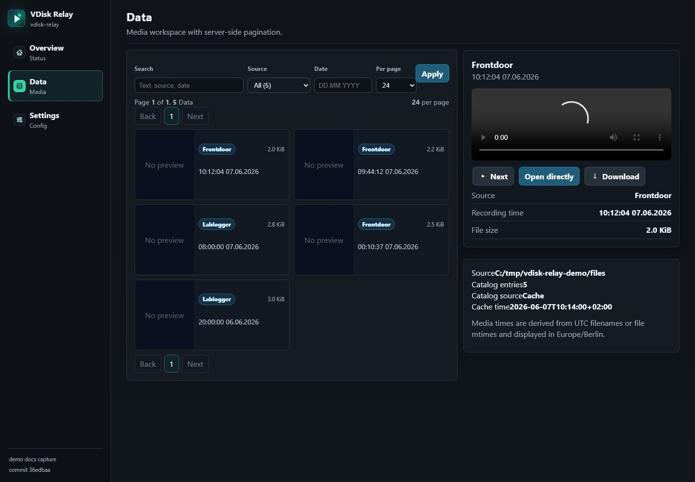
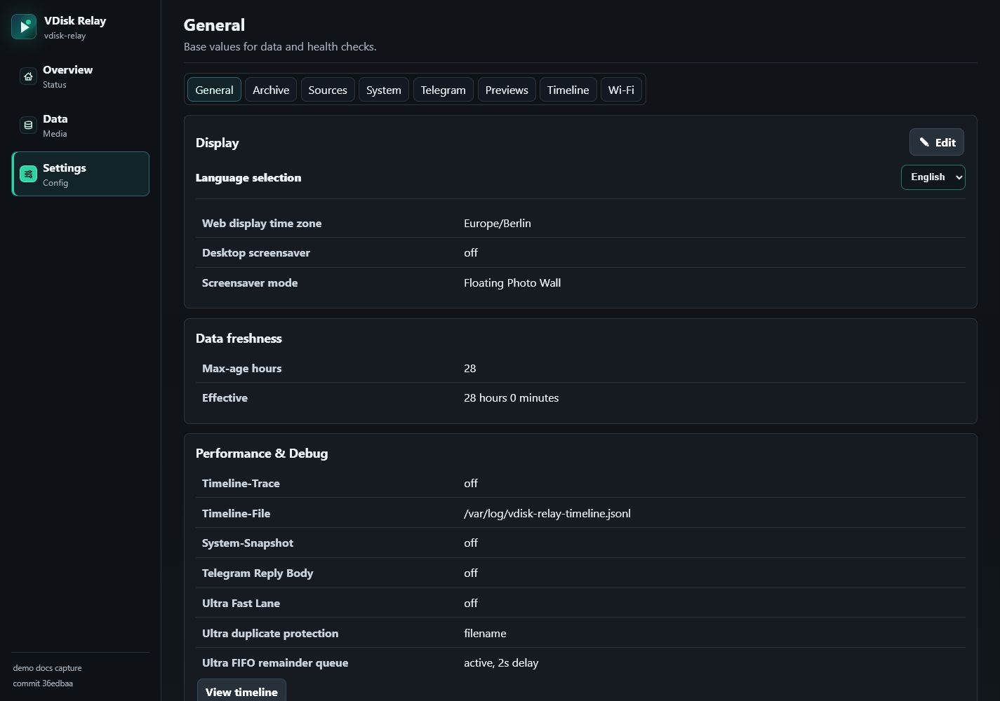
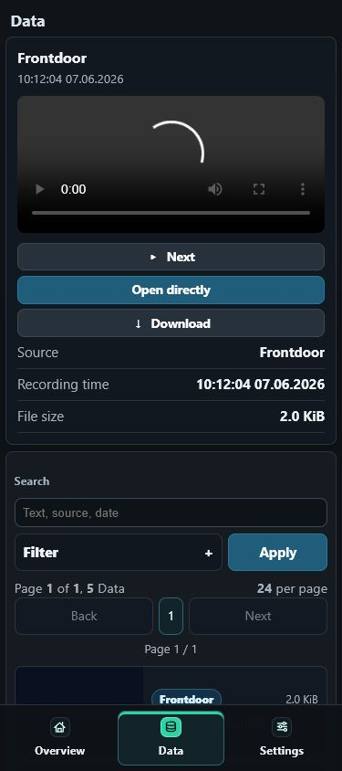

# VDisk Relay

VDisk Relay turns a Raspberry Pi into a virtual USB flash drive for devices that
write files to removable USB storage. The Pi exposes `/usbdisk.img` through USB
gadget mode, the host device writes files to that drive, and VDisk Relay detects
the changes, imports new files into `/files`, and can optionally send matching
files through Telegram.

Practical host examples include camera hubs such as Blink Sync Module 2,
small DVR/NVR devices, field recorders, lab or industrial data loggers, and
embedded controllers that export files to a USB flash drive.

The current target system is Raspberry Pi OS Bookworm on a Raspberry Pi Zero W.
A Pi Zero W can run the full stack, but the WebUI may become slow while sync,
preview generation, Telegram upload, or archive work is active. For a more
stable setup, use a Pi Zero 2 W or another Raspberry Pi with separate power for
the Pi and a data cable from the Pi USB/OTG port to the USB host device. VDisk
Relay does not expand limits imposed by the host device. For example, when used
with a Blink Sync Module 2, plan one relay image per Sync Module 2 system and
stay within that module's own camera and storage limits.

USB OTG power/data dongles or splitter adapters can be used for compact Pi Zero W
builds, but shop links should be treated as examples of the adapter type only,
not as project requirements or product recommendations. Verify that the adapter
actually carries USB data and that the available current is enough for the Pi
under load.

## Feature Highlights

- USB mass-storage gadget backed by `/usbdisk.img`.
- Read-only import path that copies new files into `DATA_ROOT`, usually
  `/files`.
- Source rules for labels, filename matching, file extensions, Telegram mode,
  retries, and send state.
- Server-side WebUI for Data/Media, Sources, Telegram, Wi-Fi, Maintenance,
  Update, Services, and diagnostics.
- Responsive WebUI with web app manifest, app icons, service worker, and
  browser install-prompt support when the client browser treats the local site
  as installable.
- Preview cache with generated thumbnails and a fast media catalog.
- Web display timezone for Media/Data timestamps and date grouping.
- Persistent Telegram delivery queue for the normal path.
- Optional Ultra Fast Lane test path for low-latency direct sends.
- Optional rsync-daemon archive destination.
- Health checks for stale data and USB/image consistency.
- Network Guardian emergency AP and recovery flow.
- Config backup/restore and controlled WebUI update flow.
- English default WebUI plus German WebUI language catalog.

## Main Components

| Component | Purpose |
|---|---|
| USB gadget | Exposes `/usbdisk.img` through `g_mass_storage`. |
| Watch/trigger | Detects image changes with `systemd.path` and sets pending state. |
| Live sync | Mounts the image read-only, copies new files to `/files`, and unmounts cleanly. |
| Fast Lane | Starts an early `live-sync --fast` after a trigger. The retry timer remains the fallback. |
| Ultra Fast Lane | Optional low-latency test path that sends directly from a read-only shadow mount, then syncs to `/files`. Disabled by default. |
| Telegram queue | Persistent Telegram delivery queue for the normal path. |
| Preview cache | Builds `files.json`, preview images, and preview backlog state. |
| Archive | Copies `/files/` to an external rsync-daemon target. |
| Health | Checks the newest active file and can notify/reboot when data gets stale. |
| Network Guardian | Optional emergency WiFi/AP recovery mode. |
| WebUI | Responsive local UI for Data, Sources, Telegram, WiFi, Maintenance, Update, and State. |

## WebUI Screenshots

Screenshots use sanitized demo data from the English WebUI.

| Overview | Data/Media |
|---|---|
|  |  |

| General Settings | Mobile Data Layout |
|---|---|
|  |  |

### Settings Tabs and Mapping

Settings are now grouped in the WebUI tabs:

- General
- Display
- Timeline
- Performance
- Previews
- Telegram
- System
- Actions

Notes:

- `System` is a real status/details page. It aggregates read-only freshness,
  runtime mode, timeline/diagnostic and latest job state, and links to Services,
  Diagnostics, Stale Detection, Update, Sources, Wi-Fi, Archive and Boot notify.
- `Actions` contains manual operational actions such as image checks, image import,
  archive runs, reboot/shutdown and config backup/restore.
- `Telegram` remains the settings entry point and now links the full Telegram
  area: overview, bot settings, chat settings, boot notify, queue, diagnostics
  and maintenance notifications.
- `Previews` contains the delete-with-recording setting and links to the preview
  cache detail page with backlog, ignored files and cache state.
- This is a **UI-only regrouping**. Backend config keys and existing POST
  endpoints remain unchanged.

For details on backend configuration keys (defaults, environment variables and
service behavior), keep using the existing configuration documentation:

- `docs/configuration-reference.md`

## WebUI PWA Notes

The WebUI includes a web app manifest, 192 px and 512 px icons, mobile viewport
metadata, and a service worker. Browser installation is optional and depends on
the client browser. Chrome install prompts require the page to satisfy Chrome's
current installability criteria, including suitable manifest fields such as
`name` or `short_name`, icons, `start_url`, and `display`. HTTPS or another
secure context may also be required by the browser for installability and service
worker behavior.

The default deployment serves the WebUI at `http://<host>/` on the local network.
If the browser does not offer installation for that local HTTP origin, use the
WebUI as a normal local web page or place it behind trusted HTTPS. VDisk Relay
does not ship a Play Store Android wrapper. If one is added later, use Google's
Android Trusted Web Activities guidance for wrapping web-app content.

References:

- [Chrome installability criteria](https://developer.chrome.com/blog/update-install-criteria)
- [Chrome web app manifest installability](https://developer.chrome.com/docs/lighthouse/pwa/installable-manifest?hl=en)
- [Chrome HTTPS best-practice audit](https://developer.chrome.com/docs/lighthouse/best-practices/is-on-https)
- [Android Trusted Web Activities](https://developer.android.com/develop/ui/views/layout/webapps/trusted-web-activities)

## Runtime Paths

Installed programs:

```text
/usr/local/sbin/vdisk-relay
/usr/local/sbin/vdisk-relay-web-admin
/usr/local/sbin/vdisk-relay-preview-cache
/usr/local/sbin/vdisk-relay-status-cache
/usr/local/sbin/vdisk-relay-update-run
```

Configuration and secrets:

```text
/etc/vdisk-relay.conf
/etc/vdisk-relay.env
/root/vdisk-relay-rsync.pass
/usr/local/share/vdisk-relay/i18n/en.json
/usr/local/share/vdisk-relay/i18n/de.json
```

Runtime data, not tracked by git:

```text
/run/vdisk-relay/
/run/vdisk-relay-www/
/var/lib/vdisk-relay/
/var/cache/vdisk-relay-previews/
/var/log/vdisk-relay.log
/var/log/vdisk-relay-timeline.jsonl
/files/
/usbdisk.img
```

systemd reference:

```text
docs/systemd-reference.md
```

## Installation

Clone the public repository:

```bash
git clone https://github.com/Netfreak25/vdisk-relay.git vdisk-relay
cd vdisk-relay
```

Primary deployment path:

```bash
deploy/bookworm/install.sh
```

The installer copies files, installs systemd units, installs the WebUI, fills
missing config defaults, creates required directories, and preserves existing
secrets and gate decisions. On git checkouts it runs `git pull --ff-only` by
default before installing.

Important: `install.sh` does not change the Raspberry Pi boot configuration.
USB gadget boot setup is handled by:

```bash
deploy/bookworm/dependencies.sh --configure-gadget
```

or together with package installation:

```bash
deploy/bookworm/dependencies.sh --all
```

That step adds `dtoverlay=dwc2` to the Pi boot config and writes
`/etc/modules-load.d/vdisk-relay.conf` for `dwc2` and `libcomposite`.
`g_mass_storage` is still started by `vdisk-relay-gadget-live.service`, not by
modules-load.
If `dtoverlay=dwc2` was newly added, reboot before expecting the host device to
see the virtual USB drive.

See also:

```text
docs/hardware.md
docs/quickstart-usb-host.md
deploy/bookworm/README.md
docs/manual-installation.md
docs/prerequisites.md
docs/troubleshooting.md
```

## First Configuration

The recommended first setup is:

```bash
deploy/bookworm/dependencies.sh --all
deploy/bookworm/install.sh --no-live
deploy/bookworm/wizard.sh
deploy/bookworm/install.sh
```

The wizard creates or updates:

```text
/etc/vdisk-relay.conf
/etc/vdisk-relay.env
/root/vdisk-relay-rsync.pass
```

It asks for the image path and local data root first. Archive, Telegram, the
first source, and live gates are optional. Skipped features stay disabled and can
be configured later in the WebUI.

The WebUI also has a setup flow. If required configuration is missing, runtime
services stay paused while the WebUI remains available.

Configuration reference:

```text
docs/configuration-reference.md
```

## Live Gates

Production behavior is controlled by gate files:

```text
/etc/vdisk-relay.live-enabled
/etc/vdisk-relay.allow-gadget
/etc/vdisk-relay.allow-watch
/etc/vdisk-relay.allow-trigger
/etc/vdisk-relay.allow-sync
/etc/vdisk-relay.allow-archive
/etc/vdisk-relay.allow-health-reboot
/etc/vdisk-relay.allow-boot-notify
```

Installer behavior:

- Existing gates are preserved during updates.
- If no gate state exists and required configuration is complete, default gates
  are created once.
- `--no-live` keeps a fresh installation passive.
- `--force-live` intentionally recreates the default gates.

## Delivery Timing

Default path:

1. Image change triggers pending state.
2. `post-trigger` starts Fast Lane when enabled.
3. Fast Lane waits briefly and runs `live-sync --fast`.
4. New files are copied to `/files`.
5. Telegram jobs are queued and processed by the queue worker.
6. The retry timer remains active as fallback.

Ultra Fast Lane:

- Disabled by default.
- Sends directly from a read-only shadow mount.
- Uses filename duplicate mode by default for low latency.
- Can send remaining new files FIFO with a small delay.
- Runs sync-after-send when enabled.
- Keeps pending state when it fails so the normal path can recover.

Debug options for timeline and Telegram reply bodies are also disabled by
default.

## State and Maintenance

CLI:

```bash
/usr/local/sbin/vdisk-relay status-lights
systemctl list-timers --all | grep vdisk-relay
systemctl --failed
tail -n 120 /var/log/vdisk-relay.log
```

WebUI:

```text
http://<host>/
```

The System / Update page can switch the repository between the `main` and `dev`
branches. A branch switch runs through the same controlled update service as a
normal update: fetch, checkout, fast-forward pull, install, and service refresh.

Generated WebUI/status cache files:

```text
/run/vdisk-relay/status.json
/run/vdisk-relay/status-login.txt
/run/vdisk-relay/status-last-attempt.json
/run/vdisk-relay-www/index.html
/run/vdisk-relay-www/status.txt
/run/vdisk-relay-www/debug.html
```

`vdisk-relay status-lights` is cache-based by default and formats the latest
`/run/vdisk-relay/status-login.txt` or `/run/vdisk-relay/status.json`. Use
`vdisk-relay status-lights --live` only for explicit administrator diagnosis.
The cache service exit code only describes whether the cache was built
successfully. A red or warning system state is stored in `status.json` and shown
by `status-lights`, but it does not make `vdisk-relay-status-cache.service`
failed.

Status components use these stable states: `OK`, `PENDING`, `WARN`, `FAIL`,
`DISABLED`, and `UNKNOWN`. The text view renders them as `OK`, `PEND`, `WARN`,
`FAIL`, `OFF`, and `UNKN`. WebUI service actions briefly show `PENDING` until a
newer status cache has been generated.

## Backup and Restore

The repository does not contain secrets or runtime data. For a full system
restore you need the config backup plus:

```text
/usbdisk.img
/files/
```

See:

```text
docs/config-backup-restore.md
```
